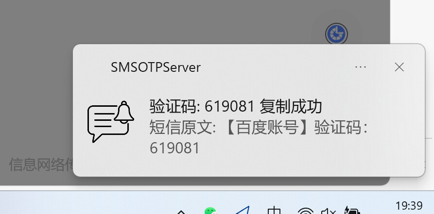
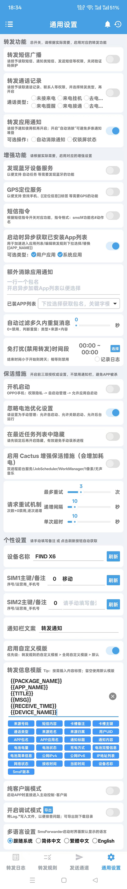
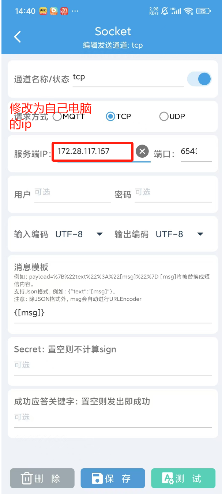
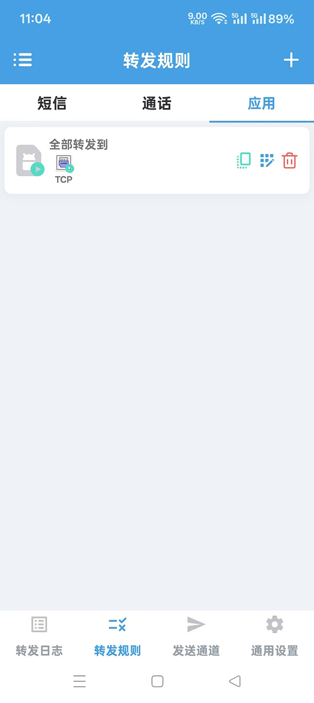
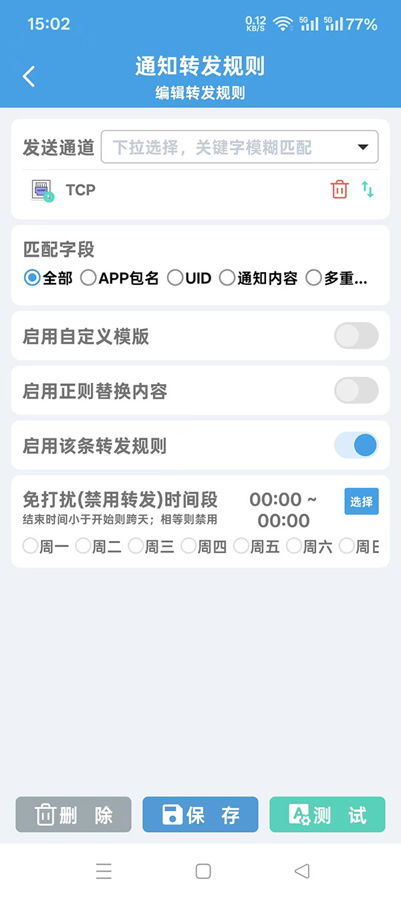

# 电脑接短信电话--实现短信验证码、应用通知自动在PC端同步
## 注：本版本为SMSOPTServer的更新版，与SmsForwarder3.3.3适配。

## 效果展示

收到验证码后，自动拦截短信发送到电脑端，在电脑右下角有托盘消息提示，并自动复制到Windows剪贴板中，直接粘贴就可以。



同时其他应用的通知也会显示在终端里。


## 安装使用步骤

### 1.安装SmsForwarder

在安卓手机上安装短信转发器SmsForwarder
https://github.com/pppscn/SmsForwarder

### 2.设置SmsForwarder的通用设置
经简化，不需要导入SmsForwarder.json了，只需记得SmsForwarder的通用设置里面要打开转发应用通知，允许获取应用列表，允许后台运行。另外转发信息模板最好改为下面格式：
```
{{PACKAGE_NAME}}
{{APP_NAME}}
{{TITLE}}
{{MSG}}
{{RECEIVE_TIME}}
{{DEVICE_NAME}}
```
### 如图所示：


### 3.发送通道-修改Socket tcp配置

需要手机与电脑在同一局域网下，修改服务端ip为电脑自己的局域网ip


### 4.发送规则

不用怎么修改，就默认匹配字段选全部就行了，记住是选应用的转发规则。




### 5.下载SMServer.exe 电脑上点击启动
https://github.com/wellsun5/SMServer/releases


### 6. 找个验证码网页开始测试


## 如何编译打包工程

**将代码clone到本地部署运行**

clone项目

```bash
git clone git@github.com:wellsun5/SMServer.git
cd SMServer
```

安装依赖

```bash
pip install -r requirements.txt
```

运行`main.py`,如果需要修改端口号 加启动参数 -p {port}

```bash
python main.py
```

打包成exe启动

```bash
pyinstaller -F --add-data "config.json;." --add-data "favicon.ico;." --icon="favicon.ico" --name="SMServer" main.py
```
启动,直接点击exe打开即可，或者在cmd命令行里修改端口号启动 
```bash
SMServer.exe -p 23456
```
加入windows自启动，创建SMServer.exe 快捷方式，按win+R 输入shell:startup执行， 在打开的文件夹里拖入刚创建的快捷方式即可。


